**完整代码 +  QQ: 316595344     或   WX: lz316595344  咨询**

**如果图片加载不出来可以去博客看 https://blog.csdn.net/qq_56450993/article/details/133212526**

# Spring Boot + Vue 电影购票系统

## 一、项目结构

- 网上购票
- 后台管理
- 客服模块

## 二、环境介绍

- 后端：SpringBoot + SpringSecurity + MyBatis-Plus
- 前端：Vue + ElementUi
- 数据库：MySQL

## 三、关于项目

- api: Spring Boot项目代码
- vue-admin: 网站管理后台代码
- vue-app: 网站前台代码
- vue-worker: 网站客服代码

## 四、系统截图

### 网上购票
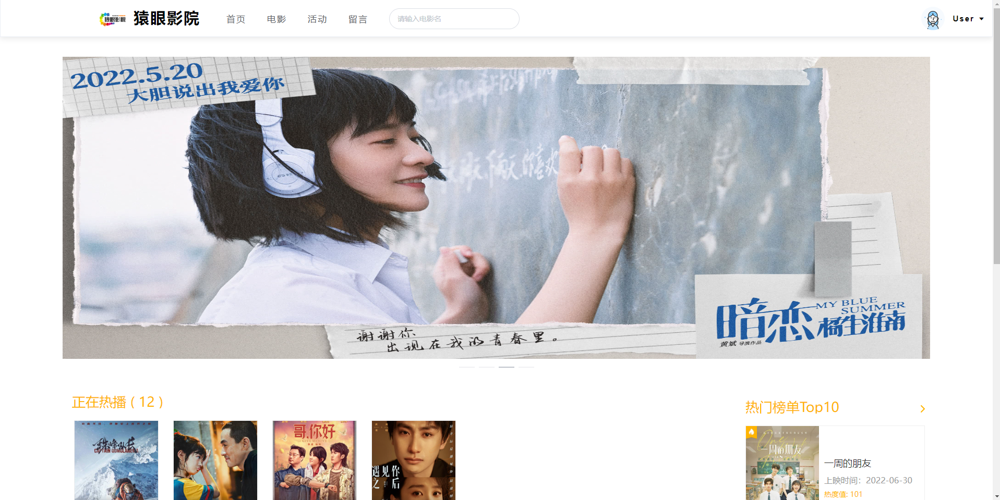

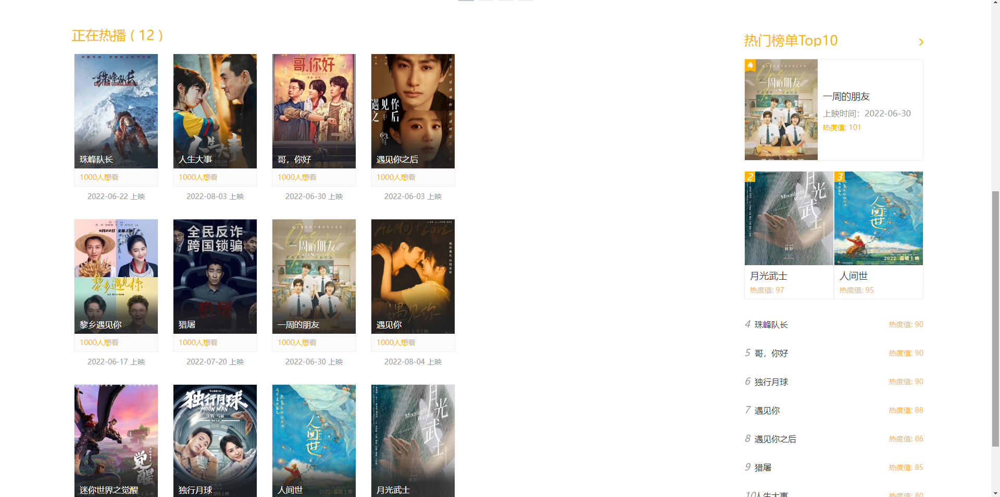

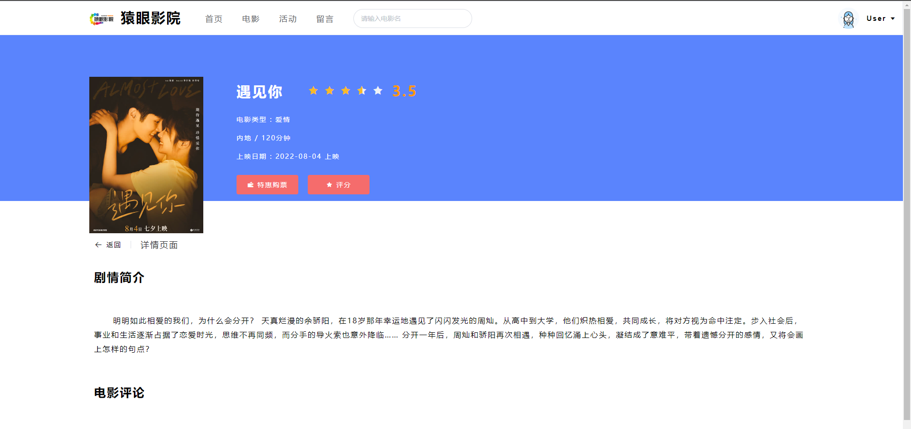

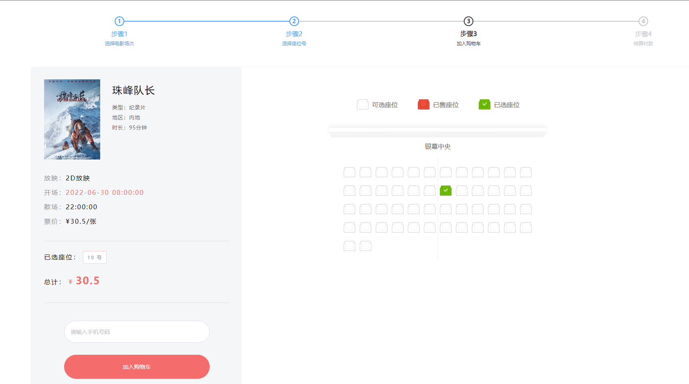

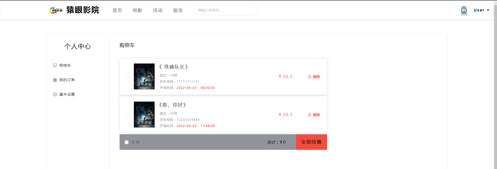

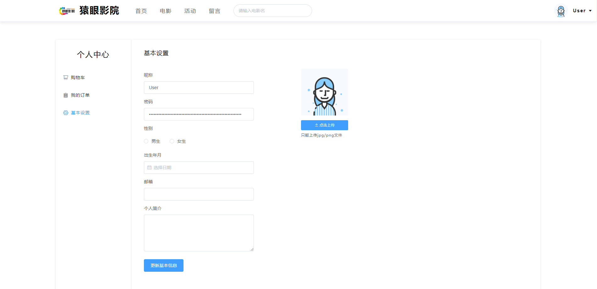

### 后台管理
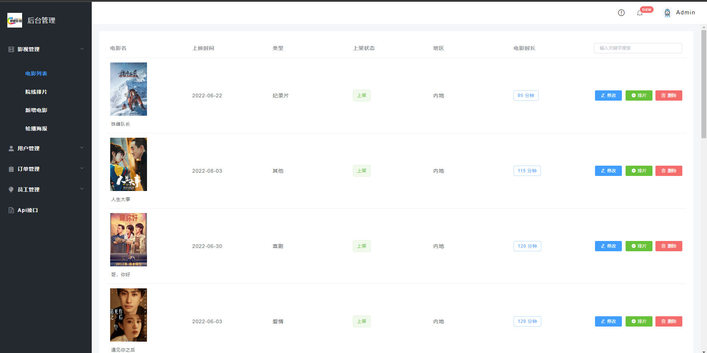

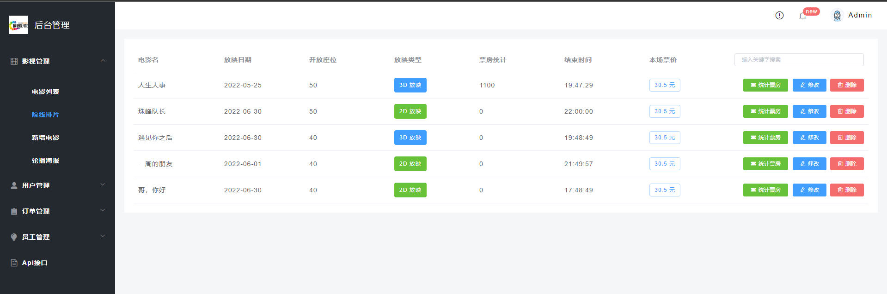

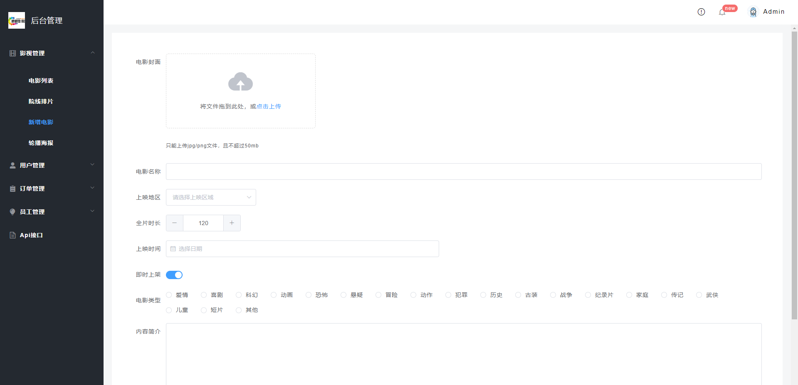

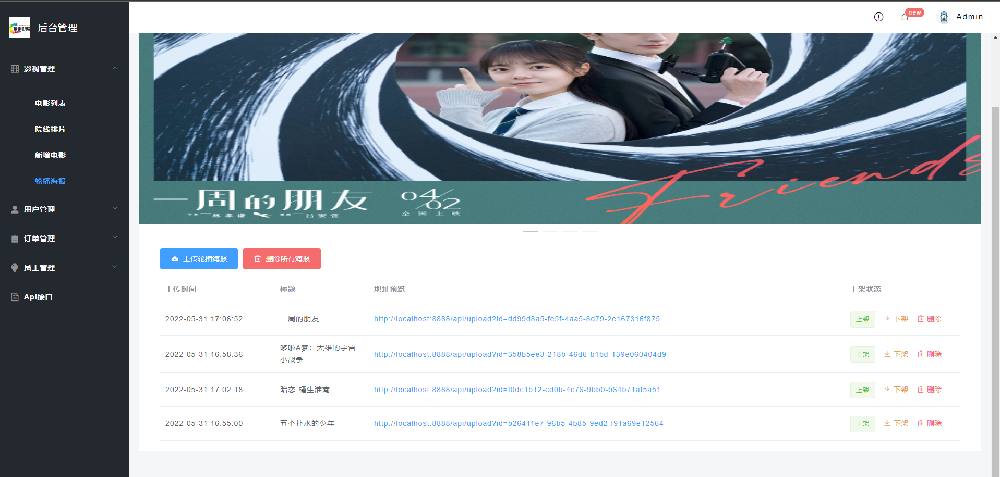

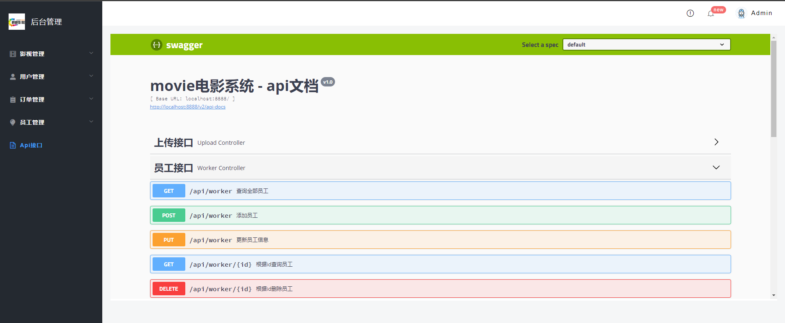

### 客服模块
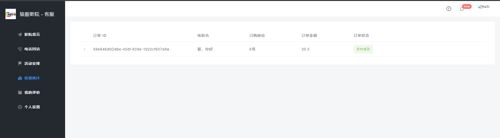

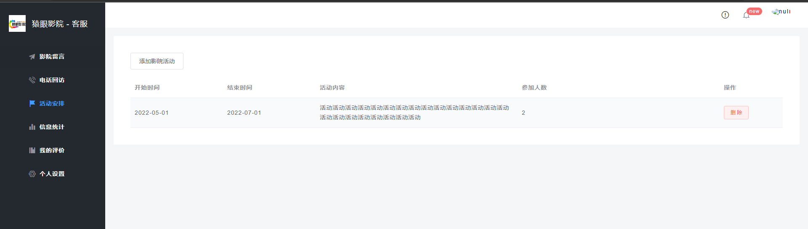

## 五、安装教程

- api为后端项目，找到 db/movie.sql（询问作者获取） ，在数据库中执行
- 修改 application.yml 中的数据库配置
- 三个vue项目首先 npm install ，然后分别 npm run serve 运行

## 六、默认账户

- 普通账户：123456  123456
- 系统管理员：admin001 123456
- 客服：worker001 123456

**完整代码 +  QQ: 316595344     或   WX: lz316595344  咨询**

**接毕业设计和论文**

**毕业设计所有选题地址**

**[github]👉https://github.com/XinChennn/allProjects**

**[gitee]👉https://gitee.com/xinchennn/allProjects**

**[忻辰的个人博客]👉https://www.ixinjiu.cn/articles/156**